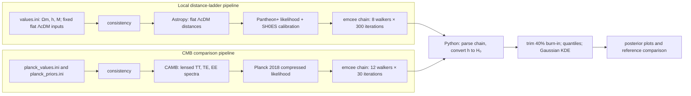

# Hubble-Tension Project: Technical Walkthrough

This guide describes the implementation in [`svsam/Hubble-Tension`](https://github.com/svsam/Hubble-Tension), based on its `main` branch configuration, Python analysis scripts, and README. It distinguishes computations performed by this project from literature values used as context. The project is an educational reproduction and comparison exercise; its short chains are not precision cosmological measurements.

## At a glance: what pipelines were used?

The repository runs two **separate CosmoSIS pipelines** under spatially flat base ΛCDM. The local pipeline uses an Astropy background calculator and the Pantheon+SH0ES supernova likelihood. The CMB pipeline uses CAMB and the Planck 2018 compressed Planck-lite likelihood. They are run independently; the project compares their results afterward rather than jointly fitting both data sets.

**The local pipeline is not a CMB analysis.** It computes late-time expansion distances and scores supernova data. Conversely, Planck-lite does calculate CMB spectra through CAMB, but its compressed likelihood is an approximation and does not reproduce the full Planck likelihood analysis. See [`pantheon_plus_shoes.ini`](https://github.com/svsam/Hubble-Tension/blob/main/pantheon_plus_shoes.ini) and [`planck_lite.ini`](https://github.com/svsam/Hubble-Tension/blob/main/planck_lite.ini).

## What parameters were used in each pipeline, and what does each do?

In the Pantheon+SH0ES run, the sampled parameters are matter density Ωm, reduced Hubble parameter (h), and the supernova absolute-magnitude nuisance parameter (M). The values file gives bounds and starting values: Ωm ∈ [0.1, 0.5] starting at 0.3; (h ∈ [0.6,0.8]) starting at 0.7; and (M ∈ [-21,-18]) starting at −19.35. The sampled (h) sets the present expansion rate, Ωm shapes the expansion history and distance-redshift relation, and (M) converts standardized supernova brightness into a calibrated absolute scale. The configuration fixes spatial curvature Ωk=0 and dark-energy equation-of-state (w=-1); it also supplies Ωb=0.04, (A_s=2.0×10^{-9}), (n_s=1.0), and τ=0.08 as compatibility inputs. The configured Astropy background uses (H_0) and Ωm; the latter CMB-oriented values are not being inferred from supernovae in this pipeline. Source: [`values.ini`](https://github.com/svsam/Hubble-Tension/blob/main/values.ini).

In Planck-lite, the sampled vector is ((h,Ω_m,Ω_b,n_s,A_s,τ)), with starts (0.674, 0.315, 0.049, 0.965, 2.1×10^{-9}, 0.054) respectively. These control the expansion rate, matter and baryon content, primordial scalar spectrum tilt and amplitude, and reionization optical depth that shape the predicted CMB spectra. The listed broad uniform prior ranges are (h:[0.55,0.85]), Ωm:[0.20,0.42], Ωb:[0.040,0.055], (n_s:[0.90,1.02]), (A_s:[1.5,2.8]×10^{-9}), and τ:[0.01,0.12]. Flatness, (w=-1), neutrino assumptions (Ωk=0, (m_ν=0.06) eV, (N_ν=3.046), one massive species), helium fraction, pivot scale, running, and tensors are fixed in [`planck_values.ini`](https://github.com/svsam/Hubble-Tension/blob/main/planck_values.ini); bounds are also listed in [`planck_priors.ini`](https://github.com/svsam/Hubble-Tension/blob/main/planck_priors.ini).

| Run | Varying parameters | Fixed assumptions / inputs | Role |
|---|---|---|---|
| Pantheon+SH0ES | Ωm, (h), (M) | Flatness, (w=-1); compatibility inputs Ωb, (A_s,n_s,τ) | Fit late-time distances and calibrated supernova brightness |
| Planck-lite | (h,Ωm,Ωb,n_s,A_s,τ) | Flat ΛCDM, neutrino and primordial-spectrum settings | Predict CMB spectra and score them against compressed Planck constraints |

## What equations are used for the calculations?

The chain stores (h), a dimensionless Hubble parameter, and the Python reader converts it to physical units using

\[
H_0=100h\;\mathrm{km\,s^{-1}\,Mpc^{-1}}.
\]

For a flat ΛCDM background, the expansion rate at redshift (z) is

\[
H(z)=H_0 E(z),\qquad
E(z)=\sqrt{\Omega_m(1+z)^3+(1-\Omega_m)}.
\]

The radial comoving distance is (D_C(z)=c\int_0^z dz'/H(z')); in a flat model the luminosity distance is (D_L(z)=(1+z)D_C(z)), and distance modulus is

\[
\mu(z)=5\log_{10}\!\left(\frac{D_L(z)}{\mathrm{Mpc}}\right)+25.
\]

The Astropy background module evaluates the expansion and distance quantities for the sampled cosmology. The Pantheon+ likelihood compares standardized observed supernova magnitudes/distances with model predictions, including covariance and the SH0ES calibration information. In schematic Gaussian form, a data likelihood has (-2\ln\mathcal L \simeq (\mathbf d-\mathbf m)^T C^{-1}(\mathbf d-\mathbf m)+\text{constant}), with residual vector δ=d-m and covariance (C); the project delegates the actual Pantheon+ likelihood calculation to the CosmoSIS Standard Library implementation rather than reimplementing it in its Python scripts.

For Planck-lite, CAMB solves the linear cosmological perturbation evolution for each trial parameter set and predicts angular spectra (C_\ell^{TT}, C_\ell^{TE}, C_\ell^{EE}), with lensing enabled and (\ell_{\max}=2800). The compressed Planck likelihood evaluates compatibility of those spectra with its compressed 2018 TT, TE, EE constraints, including their encoded uncertainty/correlation approximation. Its Gaussian-compressed likelihood is conceptually represented as (-2\ln\mathcal L_{\rm comp}\sim(\mathbf x-\mathbf x_{\rm obs})^T\Sigma^{-1}(\mathbf x-\mathbf x_{\rm obs})), where (\mathbf x) denotes the compressed observables/constraints; this is a schematic description, not a claim that the project code directly performs a raw-spectrum covariance fit. The full Planck likelihood includes more detailed data and nuisance treatment than this compressed exercise.

## What statistical method was used?

Both CosmoSIS configurations select **emcee**, an affine-invariant ensemble Markov chain Monte Carlo sampler. Each proposal is accepted or rejected according to the likelihood and prior, thereby generating samples from a posterior proportional to likelihood times prior, (p(\theta\mid d)\propto\mathcal L(d\mid\theta)\,p(\theta)). The local run is configured for eight walkers and 300 iterations (2,400 recorded rows); the Planck-lite run has twelve walkers and 30 iterations (360 rows). Uniform bounds in the value/prior files define the allowed parameter region. The chains are independent: no joint posterior is produced.

The Python script [`analyze_chain.py`](https://github.com/svsam/Hubble-Tension/blob/main/python/analyze_chain.py) removes the first 40% of rows by default, then reports the median and 16th/84th percentiles. Since rows are stored iteration-by-iteration across walkers, this row cut removes the same initial fraction of each walker. Those percentiles summarize the sampled **marginalized (H_0) distribution**: the other sampled parameters are not held to one best-fit value but vary throughout the chain. SciPy's Gaussian KDE estimates a smooth density for display, while the reported interval remains based on empirical quantiles. KDE is therefore a visualization aid, not the source of the interval. The README explicitly cautions that neither chain is convergence-tested, especially the very short Planck-lite chain.

## What was the mathematical outcome?

After the 40% cut, the project reports a local Pantheon+SH0ES chain median (H_0=73.36\;\mathrm{km\,s^{-1}\,Mpc^{-1}}), with central 68% interval (72.57) to (74.43), or asymmetric offsets (-0.78/+1.07). These are chain-derived descriptive summaries, not proven converged credible limits. The Planck-lite chain has an exploratory median of (67.39\;\mathrm{km\,s^{-1}\,Mpc^{-1}}), and the README labels its (67.30)–(67.50) retained-sample interval preliminary and unreliable because the run is too short and starts near the best fit.

For context, the README quotes published Planck 2018 base-ΛCDM (H_0=67.4\pm0.5) and SH0ES 2022 (H_0=73.04\pm1.04\;\mathrm{km\,s^{-1}\,Mpc^{-1}}). The script computes an illustrative Planck comparison as

\[
Z_{\rm illustrative}=\frac{|\tilde H_{0,\rm local}-67.4|}{\sqrt{[(q_{84}-q_{16})/2]^2+0.5^2}}\approx5.65,
\]

where (\tilde H_0) is the local-chain median and (q_{16},q_{84}) are its quantiles. This treats a potentially asymmetric, finite-chain interval as Gaussian and combines it with the published Planck uncertainty in quadrature. It is explicitly an educational approximation, not a rigorous or universal tension statistic. SH0ES appears as contextual reference even though its calibration contributes to the local likelihood; the two should not be counted as independent measurements in this comparison.

## What is the cosmic distance ladder, and how does it appear here?

The cosmic distance ladder is a sequence of distance calibrations: nearby geometric anchors calibrate Cepheid variable stars, Cepheids calibrate nearby Type Ia supernovae, and standardized Type Ia supernovae then extend the distance scale to larger redshifts. The SH0ES analysis uses this strategy to infer the current expansion rate. This project represents the ladder through the Pantheon+ supernova sample together with the included SH0ES absolute calibration. Pantheon+ relative supernova distances alone constrain the shape of the distance-redshift relation but leave an absolute-scale degeneracy between (H_0) and supernova absolute magnitude (M); including the calibration helps anchor (M) and make an absolute (H_0) posterior possible. The project does not rerun every geometric-anchor and Cepheid calibration step from raw observations; it consumes the packaged likelihood and calibration in the CosmoSIS Standard Library.

## How were nuisance parameters handled?

The local fit samples (M), the supernova absolute magnitude, as a nuisance parameter with a uniform range from −21 to −18 and a starting value −19.35. This is important because (M) and the distance scale can shift together: supernova apparent brightness alone does not establish an absolute (H_0). The `include_shoes = T` setting supplies the SH0ES calibration contribution inside the Pantheon+ likelihood, anchoring the absolute scale while the likelihood handles its internal supernova calibration/covariance details. The nuisance parameter is not simply fixed to a preferred value; it is varied in the MCMC and marginalized over when the script summarizes the (H_0) samples.

Planck-lite has no explicit sampled Planck foreground/calibration nuisance vector in this project configuration. Its compressed likelihood abstracts the CMB constraints and omits the full Planck PLC likelihood's detailed nuisance-parameter treatment. Accordingly, this simplified route is useful for a teaching comparison but cannot be interpreted as reproducing all Planck 2018 nuisance marginalization choices. Standard cosmological assumptions such as flatness and neutrino settings are fixed model inputs, not nuisance parameters sampled in this run.

## How was the data handled?

The Pantheon+ observations and covariance are loaded by the external CosmoSIS Standard Library likelihood configured by `pantheon_plus_shoes.ini`; the README says the supplied likelihood and covariance loaded successfully. This repository's local Python scripts operate downstream on CosmoSIS text-chain output rather than on individual supernova observations. [`chain_io.py`](https://github.com/svsam/Hubble-Tension/blob/main/python/chain_io.py) reads the first line for column names, skips comment metadata, parses whitespace-delimited rows with pandas, finds the `cosmological_parameters--h0` column, and appends (H_0=100h) in physical units. It rejects a chain missing the expected column. The analyzer excludes non-finite (H_0) rows and applies the declared burn-in fraction before computing summaries and KDE.

The configs request text output and `resume = F`, so each run starts a fresh chain rather than appending to prior output. The README reports a local smoke run and 300-iteration run, plus a separate Planck-lite smoke check and 30-iteration run. Plotting uses the stored samples: trace plots reshape the local chain by walker and show every stored point; the posterior histogram and rug show the retained samples, with KDE overlaid; comparison graphics distinguish chain medians/intervals from published reference values. Figures are written as 300-dpi PNG and vector PDF. The Python plotting code does not create synthetic posterior samples.

## What should and should not be concluded?

The local chain lands near the published SH0ES value, and the independent Planck-lite exercise lands near the published Planck value. That demonstrates the intended end-to-end workflow and makes the early/late-Universe comparison visible. But the chain lengths are explicitly educational, the local trace moves substantially from its initial region, and no reliable convergence diagnostics or effective sample sizes are reported. In particular, the narrow-looking Planck-lite sample interval is not a trustworthy uncertainty estimate. The project therefore illustrates the pipeline and the scale of the reported Hubble discrepancy; it does not establish a new precision value or a definitive statistical significance.

## Repository files referenced

| File | What it establishes |
|---|---|
| [`pantheon_plus_shoes.ini`](https://github.com/svsam/Hubble-Tension/blob/main/pantheon_plus_shoes.ini) | Local pipeline modules, sampler settings, Astropy model, SH0ES inclusion |
| [`values.ini`](https://github.com/svsam/Hubble-Tension/blob/main/values.ini) | Local sampled values, bounds, fixed cosmology, (M) prior |
| [`planck_lite.ini`](https://github.com/svsam/Hubble-Tension/blob/main/planck_lite.ini) | CMB pipeline modules, CAMB settings, compressed likelihood, sampler settings |
| [`planck_values.ini`](https://github.com/svsam/Hubble-Tension/blob/main/planck_values.ini) | Planck-lite starting values and fixed base-ΛCDM settings |
| [`planck_priors.ini`](https://github.com/svsam/Hubble-Tension/blob/main/planck_priors.ini) | Planck-lite uniform prior ranges |
| [`python/chain_io.py`](https://github.com/svsam/Hubble-Tension/blob/main/python/chain_io.py) | Chain parsing and dimensionless-to-physical Hubble conversion |
| [`python/analyze_chain.py`](https://github.com/svsam/Hubble-Tension/blob/main/python/analyze_chain.py) | Burn-in, quantiles, KDE, illustrative comparison statistic |
| [`python/make_plots.py`](https://github.com/svsam/Hubble-Tension/blob/main/python/make_plots.py) | Trace, posterior, and comparison figure construction |
| [`README.md`](https://github.com/svsam/Hubble-Tension/blob/main/README.md) | Reported run counts, outcomes, caveats, and literature context |

## References and further reading

- [CosmoSIS documentation](https://cosmosis.readthedocs.io/en/latest/) and [Pantheon+ likelihood documentation](https://cosmosis.readthedocs.io/en/latest/reference/standard_library/pantheon_plus.html).
- Planck Collaboration (2020), [Planck 2018 results. VI. Cosmological parameters](https://www.aanda.org/articles/aa/abs/2020/09/aa33910-18/aa33910-18.html).
- Riess et al. (2022), [A Comprehensive Measurement of the Local Value of the Hubble Constant with 1 km/s/Mpc Uncertainty](https://arxiv.org/abs/2112.04510).
- Brout et al. (2022), [The Pantheon+ Analysis: Cosmological Constraints](https://arxiv.org/abs/2202.04077).
