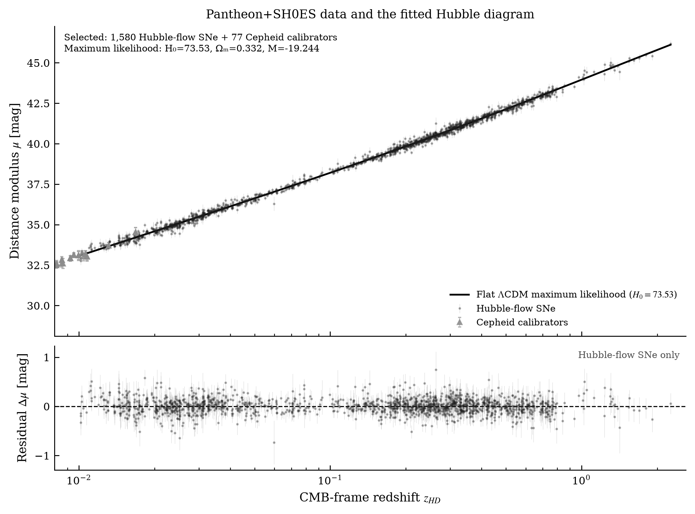

# Comparing Hubble-constant estimates with Pantheon+SH0ES

This project compares two analyses of the same calibrated Type Ia supernova data with published measurements of the present expansion rate. It runs a Markov chain Monte Carlo (MCMC) analysis and a deterministic maximum-likelihood fit through CosmoSIS. The aim is to make the difference between early-Universe and local distance-ladder estimates visible, much like a diagram makes differences between stars visible through measured properties.

## The question

Can Pantheon+ supernova distances, with the SH0ES Cepheid calibration, recover the high local value of **H₀**, and do two different data-analysis methods give a similar result?

The reference values used for context are:

- **Planck 2018, base ΛCDM:** H₀ = 67.4 ± 0.5 km s⁻¹ Mpc⁻¹. This is an inference from the cosmic microwave background (CMB) under a cosmological model.
- **SH0ES 2022:** H₀ = 73.04 ± 1.04 km s⁻¹ Mpc⁻¹. This is a local Cepheid–supernova distance-ladder result.

The discrepancy between early-Universe and late-Universe determinations is called the Hubble tension. SH0ES is included in the likelihood used here as a calibration, so its published value is contextual and is not an independent cross-check of this project's fit.

## Data and cosmological model

The project uses the CosmoSIS Standard Library's Pantheon+SH0ES likelihood and its full statistical-plus-systematic covariance. The data file has 1,701 rows. The likelihood selects 1,657: 1,580 Hubble-flow supernovae with zHD > 0.01, plus 77 Cepheid calibrators. It uses the calibrators' Cepheid distances to anchor the absolute magnitude and the supernova distance scale.

Both Pantheon+SH0ES runs use the same flat ΛCDM model, data selection, likelihood, covariance, and parameter bounds. The sampled parameters are:

| Parameter | Meaning | Range / treatment |
|---|---|---|
| h = H₀/100 | Dimensionless expansion rate; H₀ = 100h km s⁻¹ Mpc⁻¹ | Uniform 0.6–0.8 |
| Ωm | Present matter density fraction; controls the expansion history | Uniform 0.1–0.5 |
| M | Standardized supernova absolute magnitude nuisance parameter | Uniform −21 to −18; SH0ES calibration helps anchor it |

Spatial curvature is fixed to zero and dark energy is a cosmological constant, w = −1. Other listed background quantities in [`values.ini`](values.ini) are fixed compatibility inputs for this background-only supernova calculation; they are not inferred from these data. The local pipeline is configured in [`pantheon_plus_shoes.ini`](pantheon_plus_shoes.ini).

Pantheon+ relative distances alone cannot fix an absolute H₀: the expansion scale and supernova absolute magnitude can shift together. The included SH0ES calibration helps break that degeneracy. The project uses the packaged likelihood and calibration; it does not reanalyse the underlying Cepheid observations.

## Two ways to handle the data

### 1. MCMC posterior

[`pantheon_plus_shoes.ini`](pantheon_plus_shoes.ini) uses CosmoSIS emcee with eight walkers and 300 iterations per walker, for 2,400 recorded rows. MCMC proposes parameter values and accepts or rejects them according to the likelihood and prior, producing correlated samples from the posterior. The Python analysis removes the first 40% as burn-in and reports the median and 16th/84th percentiles. This summarizes H₀ while allowing Ωm and M to vary across the chain.

### 2. Deterministic maximum likelihood

[`pantheon_plus_shoes_maxlike.ini`](pantheon_plus_shoes_maxlike.ini) runs CosmoSIS's bounded BFGS optimizer on the same data and model. This is not Monte Carlo: it searches for the parameter point with the largest likelihood and returns one best-fit point. The saved inverse-Hessian covariance gives a local, quadratic approximation to parameter uncertainty. Its H₀ error is symmetric and depends on the likelihood being approximately Gaussian near the optimum; it is not a marginalized posterior interval.

The optimizer found a much better likelihood than its initial point but emitted a precision-loss warning at termination. Its best-fit value is useful for comparison, while its Hessian-based uncertainty is provisional and should be checked with a profile-likelihood scan or a longer, well-converged chain before precision interpretation.

## Results

| Estimate | H₀ [km s⁻¹ Mpc⁻¹] | How it was obtained |
|---|---:|---|
| Pantheon+SH0ES MCMC | 73.36 (+1.07/−0.78); central 68%: 72.57–74.43 | Median and quantiles after 40% burn-in; educational chain, not convergence-grade |
| Pantheon+SH0ES maximum likelihood | 73.53 ± 1.59 | Deterministic best fit and local inverse-Hessian error |
| Planck 2018 reference | 67.4 ± 0.5 | Published base-ΛCDM CMB inference |
| SH0ES 2022 reference | 73.04 ± 1.04 | Published local distance-ladder value; its calibration enters this project's likelihood |

The two Pantheon+SH0ES methods place their central estimates close together near 73.4 km s⁻¹ Mpc⁻¹. Their uncertainty estimates differ: the MCMC interval is asymmetric and the deterministic error uses a local curvature approximation. The MCMC chain is short, and the BFGS run reported precision loss, so neither uncertainty should be treated as a precision result.

For context, comparing the local MCMC median with the published Planck value using half the MCMC interval width as a Gaussian uncertainty gives an illustrative difference of about 5.65σ. This is a teaching approximation, not a rigorous or universal tension statistic. SH0ES calibration is part of the Pantheon+SH0ES likelihood, so the SH0ES reference is not statistically independent of the local fit.

## Figures

 The fit uses the full covariance, including correlations. Cepheid calibrators use their measured Cepheid distance moduli and are marked separately; the cosmological curve is compared with Hubble-flow supernovae. The lower panel shows Hubble-flow residuals from the deterministic best-fit curve.

The trace marks every recorded MCMC value and the burn-in cut. The posterior histogram and KDE show the retained H₀ samples. The comparison figure places the MCMC interval, deterministic fit and error bar, and published values on one physical scale. Its figures use monochrome styling except for muted walker colours on the trace and are saved as 300-dpi PNGs.

## Planck reference

The comparison uses the conventionally cited Planck 2018 base-ΛCDM result, H₀ = 67.4 ± 0.5 km s⁻¹ Mpc⁻¹, as a published reference value. This project does not run a Planck likelihood or recompute that constraint; it compares the reference with the Pantheon+SH0ES analysis and published SH0ES value.

## Literature context

Planck Collaboration's final 2018 cosmological-parameter analysis inferred H₀ = 67.4 ± 0.5 under base ΛCDM, a precise but model-dependent early-Universe result. Verde, Treu and Riess (2019) reviewed how improved late-Universe measurements had grown discrepant from the CMB inference and discussed evidence from more than one local technique. Riess et al. (2022) reported 73.04 ± 1.04 from the SH0ES Cepheid–supernova distance ladder after testing different anchors and analysis choices.

Brout et al. (2022) presented Pantheon+, containing 1,701 light curves from 1,550 distinct Type Ia supernovae; with SH0ES calibration their stated flat-wCDM analysis found a value near 73.5 ± 1.1. Di Valentino et al. (2021) reviewed many proposed explanations for the tension, without establishing one. Freedman et al. (2024) provide modern context on independent distance indicators and calibration choices. Together this literature frames the issue as a comparison between methods that probe different epochs and depend on different physical assumptions. This project demonstrates that comparison without deciding whether the cause is calibration, systematic effects, or new physics.

## References

- CosmoSIS: [documentation](https://cosmosis.readthedocs.io/en/latest/), [installation](https://cosmosis.readthedocs.io/en/latest/intro/installation.html), [Standard Library](https://cosmosis.readthedocs.io/en/latest/usage/standard_library_overview.html), and [Pantheon+ likelihood](https://cosmosis.readthedocs.io/en/latest/reference/standard_library/pantheon_plus.html); Zuntz et al. (2015), [CosmoSIS: Modular cosmological parameter estimation](https://arxiv.org/abs/1409.3409).
- Planck Collaboration (2020), [Planck 2018 results. VI. Cosmological parameters](https://www.aanda.org/articles/aa/abs/2020/09/aa33910-18/aa33910-18.html).
- Riess et al. (2022), [SH0ES local distance-ladder measurement](https://arxiv.org/abs/2112.04510).
- Brout et al. (2022), [The Pantheon+ Analysis: Cosmological Constraints](https://arxiv.org/abs/2202.04077).
- Verde, Treu & Riess (2019), [Tensions between the Early and the Late Universe](https://arxiv.org/abs/1907.10625).
- Di Valentino et al. (2021), [A Review of Hubble-Tension Solutions](https://arxiv.org/abs/2103.01183).
- Freedman et al. (2024), [JWST distance-scale study](https://arxiv.org/abs/2408.06153), included as modern context only.
