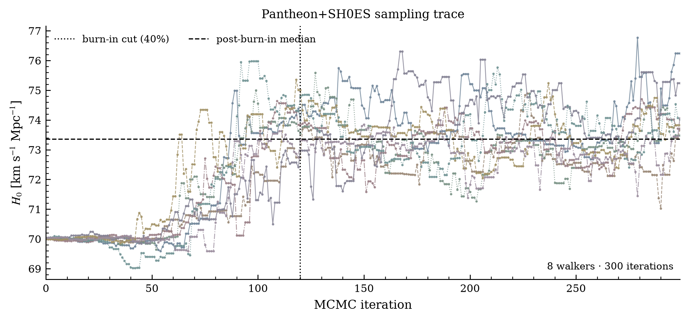
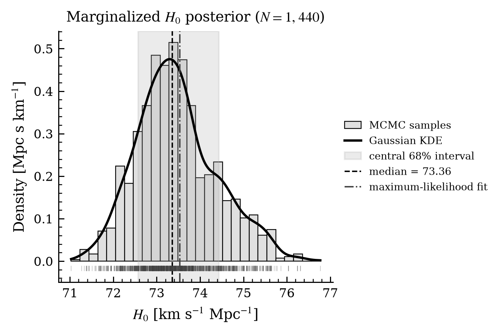
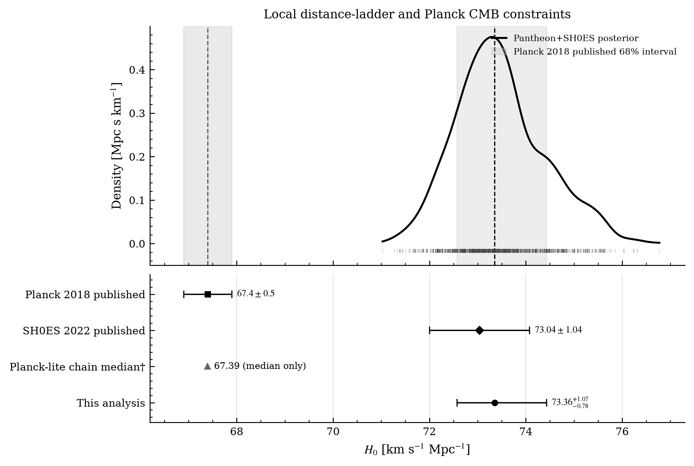

# Reproducing the Hubble tension with CosmoSIS

An undergraduate computational cosmology project: run the supplied Pantheon+SH0ES and compressed Planck-lite likelihoods in separate CosmoSIS pipelines, inspect their MCMC chains in Python, and compare the local distance-ladder result with both a Planck-likelihood exercise and Planck's published base-ΛCDM inference.

## The problem

The Hubble constant, $H_0$, describes the Universe's present expansion rate and is expressed in km s⁻¹ Mpc⁻¹. Two well-known routes to its value give different results:

- **Early-Universe inference:** Planck's CMB observations, interpreted under base ΛCDM, imply $H_0=67.4\pm0.5$ km s⁻¹ Mpc⁻¹.
- **Local distance ladder:** the SH0ES Cepheid–Type Ia supernova analysis reports $H_0=73.04\pm1.04$ km s⁻¹ Mpc⁻¹.

The CMB result is inferred from the early Universe through a cosmological model. The distance ladder calibrates nearby Cepheid distances and uses Type Ia supernovae to reach larger distances. Comparing the two methods is commonly called the Hubble tension. This project asks whether a small CosmoSIS parameter-inference pipeline can reproduce and clearly display that difference.

## The approach

The model for both runs is spatially flat ΛCDM. The local-distance configuration starts from the Standard Library's `pantheon_plus_shoes.ini` example, fixes curvature to zero and $w=-1$, and keeps the supplied Pantheon+ likelihood with `include_shoes = T`. Pantheon+ supernovae constrain relative distances; without an absolute calibration, supernova absolute magnitude and expansion scale are degenerate. The included SH0ES calibration anchors that scale.

CosmoSIS samples $Ω_m$, the reduced Hubble parameter $h$, and supernova absolute magnitude $M$ in the Pantheon+SH0ES run. Since $h=H_0/(100\,\mathrm{km\,s^{-1}\,Mpc^{-1}})$, the Python analysis converts the chain using $H_0=100h$. Fixed background inputs and priors are documented in [`values.ini`](values.ini) and [`pantheon_plus_shoes.ini`](pantheon_plus_shoes.ini).

The second configuration, [`planck_lite.ini`](planck_lite.ini), uses CAMB to calculate CMB spectra and the CosmoSIS Standard Library's Python **Planck-lite 2018 TT,TE,EE compressed likelihood**. It samples $h$, $Ω_m$, $Ω_b$, $n_s$, $A_s$, and $τ$ with broad top-hat priors documented in [`planck_values.ini`](planck_values.ini) and [`planck_priors.ini`](planck_priors.ini); flatness, Λ, and the standard neutrino assumptions are fixed. The compressed likelihood supplies a Gaussian approximation to the published CMB constraints and omits the full PLC nuisance-parameter treatment. This makes it practical for a teaching comparison, but it is not a reproduction of Planck Collaboration's full parameter analysis. The chain and its posterior are labelled **Planck-lite** throughout. The literature's $67.4\pm0.5$ value remains separately labelled **Planck 2018 published**.

In plain terms, a **Planck likelihood** scores how well a model's predicted CMB temperature and polarization power spectra match the observed Planck spectra. It accounts for measurement uncertainty and correlations between spectral bins. CAMB generates the predicted spectra for each trial cosmology; Planck-lite compares them with its compressed 2018 data product and returns a likelihood. MCMC combines those scores with the stated parameter priors to map a posterior, including a marginalized posterior for $H_0$.

The Python workflow is split into three small programs:

1. [`chain_io.py`](python/chain_io.py) reads the CosmoSIS text chain and adds $H_0$ in physical units.
2. [`analyze_chain.py`](python/analyze_chain.py) removes the declared burn-in fraction, calculates posterior percentiles, and estimates a smooth density with SciPy's Gaussian KDE.
3. [`make_plots.py`](python/make_plots.py) creates the trace, posterior, and comparison figures with Matplotlib. The comparison includes the local-chain posterior, the exploratory Planck-lite chain median, and published reference intervals. Every retained local-chain sample appears in the rug marks; every recorded local-chain point is marked on the trace. Figures are exported as 300-dpi PNGs and vector PDFs for reports and journal workflows.

## What this run found

The supplied Pantheon+ likelihood and covariance loaded successfully. A one-iteration smoke run verified the CosmoSIS-to-text-to-Python path, followed by a 300-iteration emcee run with eight walkers. The saved local educational chain has 2,400 rows and a mean acceptance fraction of 0.666. The Planck-lite configuration passed a pipeline smoke check with CAMB and the compressed likelihood, then completed a separate 30-iteration run with 12 walkers (360 rows). That short Planck chain has not been convergence-tested; its sample interval is preliminary and must not be read as a reliable uncertainty.

After dropping the first 40% of the Pantheon+SH0ES chain as burn-in, the local chain gives:

| Quantity | Result | Provenance |
|---|---:|---|
| $H_0$ median | 73.36 km s⁻¹ Mpc⁻¹ | Marginalized from this project's CosmoSIS chain |
| Central 68% interval | 72.57–74.43 km s⁻¹ Mpc⁻¹ | 16th and 84th percentiles of retained samples; asymmetric errors −0.78/+1.07 |
| Planck-lite chain median | 67.39 km s⁻¹ Mpc⁻¹ | This project's short compressed-likelihood run; preliminary only |
| Planck-lite sample interval | 67.30–67.50 km s⁻¹ Mpc⁻¹ | Central 68% of retained rows, not a reliable posterior interval because the chain is too short and starts near the best fit |
| Planck reference | $67.4\pm0.5$ km s⁻¹ Mpc⁻¹ | Published Planck 2018 base-ΛCDM result |
| SH0ES reference | $73.04\pm1.04$ km s⁻¹ Mpc⁻¹ | Published 2022 result; calibration is included in this project's likelihood |

Using half the local chain's central 68% interval as a Gaussian uncertainty gives an illustrative difference of about 5.65σ from the published Planck value. This is a teaching-level approximation, not a rigorous or universal tension statistic. The Planck-lite run verifies the CMB likelihood pathway and gives an initial comparison near the published Planck value, but 30 iterations are insufficient to map its posterior width. Its displayed sample interval is explicitly marked preliminary. Both chains are educational and should not be treated as precision measurements or robustly converged uncertainties.

## Figures

The trace distinguishes walkers with muted colours and marks the burn-in cut. The posterior and comparison charts use black, white, and grayscale. The comparison's lower panel shows error bars for the local-chain central interval and both published reference values. The Planck-lite chain is marked by its exploratory median only because its short run does not justify a reliable error bar. SH0ES is included as context, not an independent data set, because its calibration enters the Pantheon+ likelihood. Each preview below links to a vector PDF for publication or further layout work.

[Trace PDF](plots/h0_trace.pdf) · [300-dpi PNG](plots/h0_trace.png)

[Posterior PDF](plots/h0_posterior.pdf) · [300-dpi PNG](plots/h0_posterior.png)

[Comparison PDF](plots/h0_planck_comparison.pdf) · [300-dpi PNG](plots/h0_planck_comparison.png)

## Literature context

Planck Collaboration's 2018 CMB analysis, published in 2020, obtained very precise cosmological constraints and inferred $H_0=67.4\pm0.5$ km s⁻¹ Mpc⁻¹ under base ΛCDM. This is an early-Universe inference conditional on that model. As late-Universe measurements improved, Verde, Treu and Riess (2019) reviewed the growing discrepancy and noted that it was not obviously confined to one local measurement technique. Riess et al. (2022) reported $H_0=73.04\pm1.04$ km s⁻¹ Mpc⁻¹ from the SH0ES Cepheid–supernova distance ladder, after examining variations in anchors and analysis choices.

Brout et al. (2022) introduced the Pantheon+ sample used by this project: 1,701 light curves from 1,550 distinct Type Ia supernovae. With SH0ES calibration, their flat-$w$CDM analysis found a value near $73.5\pm1.1$ km s⁻¹ Mpc⁻¹. Broader reviews, including Di Valentino et al. (2021), document many proposed explanations, but no solution is established by this project. Freedman et al. (2024) provide useful modern context: independent distance indicators and calibration choices continue to matter. Taken together, the literature frames the tension as a comparison between methods that probe different epochs and depend on different assumptions; this project reproduces that comparison without deciding whether its origin is systematic error, calibration, or physics beyond ΛCDM.

## Limitations and open questions

- **Convergence:** the trace moves substantially from its initial $h=0.7$ starting ball. Later samples explore a broad band, but a 300-iteration chain cannot establish reliable effective sample size or stable posterior intervals. Would the result stabilize with longer runs and multiple 
- **Tension statistic:** the quadrature estimate treats an asymmetric interval as Gaussian and does not model cross-dataset systematics. A full consistency analysis would need a more complete statistical treatment.
- **Planck likelihood:** the added Planck-lite likelihood is a compressed Gaussian approximation. It is suitable for a clear independent comparison exercise, but does not include the full PLC likelihood's detailed nuisance modelling. The literature comparison remains the published Planck 2018 result.
- **Comparison:** the Planck-lite likelihood is run in this project, but the chain is too short to report a reliable uncertainty; its median is shown as a pipeline check only. The $67.4\pm0.5$ interval is imported from the full Planck 2018 base-ΛCDM analysis. SH0ES is not independent of the Pantheon+SH0ES chain because its calibration is included in that likelihood.

## References

- CosmoSIS: [documentation](https://cosmosis.readthedocs.io/en/latest/), [installation](https://cosmosis.readthedocs.io/en/latest/intro/installation.html), [Standard Library overview](https://cosmosis.readthedocs.io/en/latest/usage/standard_library_overview.html), [Pantheon+ likelihood](https://cosmosis.readthedocs.io/en/latest/reference/standard_library/pantheon_plus.html), and Zuntz et al. (2015), [CosmoSIS: Modular cosmological parameter estimation](https://arxiv.org/abs/1409.3409).
- Planck Collaboration (2020), [Planck 2018 results. VI. Cosmological parameters](https://www.aanda.org/articles/aa/abs/2020/09/aa33910-18/aa33910-18.html).
- Riess et al. (2022), [SH0ES local distance-ladder measurement](https://arxiv.org/abs/2112.04510).
- Brout et al. (2022), [The Pantheon+ Analysis: Cosmological Constraints](https://arxiv.org/abs/2202.04077).
- Verde, Treu & Riess (2019), [Tensions between the Early and the Late Universe](https://arxiv.org/abs/1907.10625).
- Di Valentino et al. (2021), [A Review of Hubble-Tension Solutions](https://arxiv.org/abs/2103.01183).
- Freedman et al. (2024), [JWST distance-scale study](https://arxiv.org/abs/2408.06153), included as modern context only.
